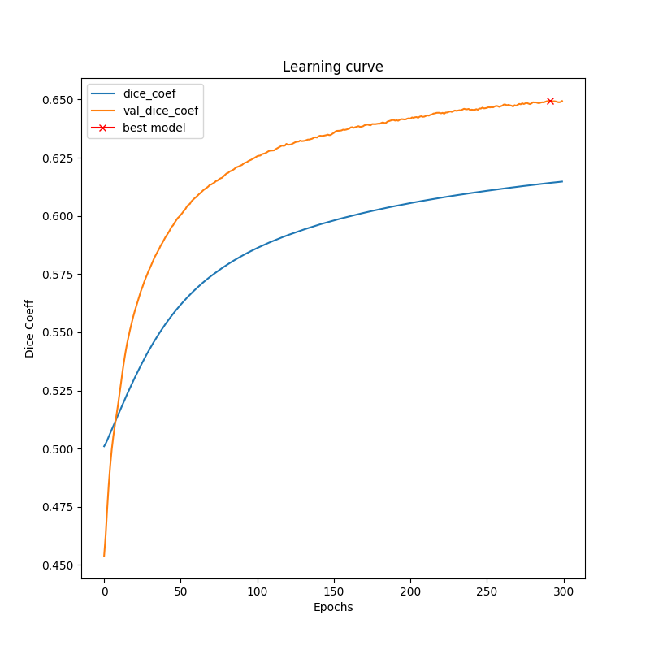
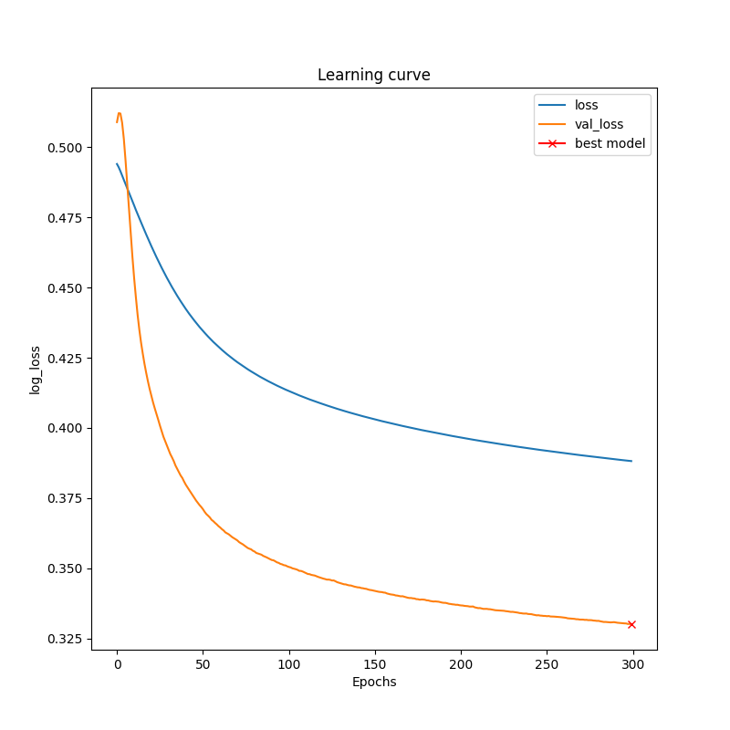

# Repository for [A Multi-organ Nucleus Segmentation Challenge](https://ieeexplore.ieee.org/document/8880654).

Note: This project is a work-in-progress, and not quite ready for real usage. If you're interested in using it, feel free to ⭐️ the repo so we know!

Dataset can be downloaded from [Grand Challenge Webiste](https://monuseg.grand-challenge.org/)

3 Segmentation models would be trained:

## U-Net

## SegNet

## DeepLab v3
